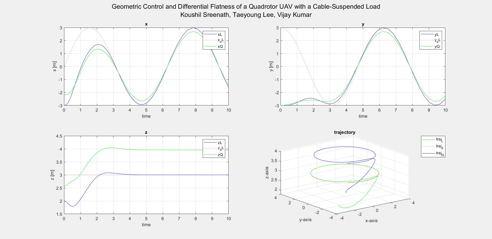

# Matlab simulation and implementation 
### Geometric Control and Differential Flatness of a Quadrotor UAV with a Cable-Suspended Load
*Koushil Sreenath, Taeyoung Lee, Vijay Kumar*

[Paper](https://ieeexplore.ieee.org/document/6760219)

### Download instructions
- In Terminal,
  ```
  git clone https://github.com/diegosdantonio/GCDF_cable-suspended_load
  ```

### Plots



For more details see https://github.com/vkotaru/quad_geometric_control
