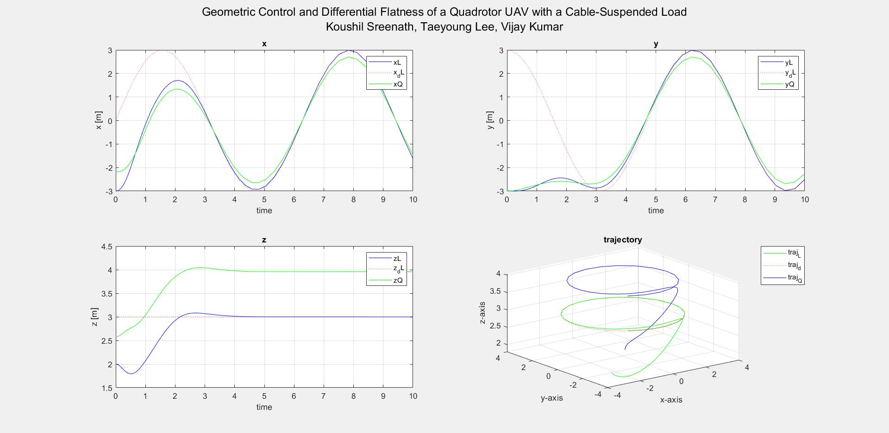

# Matlab simulation and implementation of Geometric Control and Differential Flatness of a Quadrotor UAV with a Cable-Suspended Load
*Koushil Sreenath, Taeyoung Lee, Vijay Kumar*

[Paper](https://ieeexplore.ieee.org/document/6760219)

#Download

#Plots

